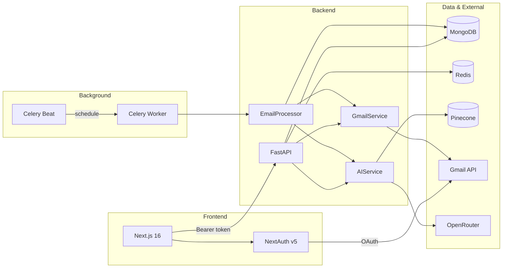

# Draftly

AI-assisted Gmail inbox assistant. Connects to Gmail, generates draft replies for relevant unread emails, and lets you review, edit, approve, or reject before sending.

## Features

- Google OAuth sign-in with Gmail access
- Inbox view with draft status badges and infinite scroll
- Message detail page with inline draft review and actions
- Draft workflow: edit, approve & send, reject, regenerate
- Background inbox polling via Celery (automatic draft generation)
- Manual inbox sync from the UI
- Writing-style context from past sent emails (Pinecone embeddings)
- Audit log of draft actions

## Architecture



**Request flow**

1. User signs in via NextAuth (Google). Access token stays on the server.
2. Frontend server components/actions call the FastAPI backend with `Authorization: Bearer <token>`.
3. On login, frontend syncs the user profile and stores OAuth tokens in MongoDB + Redis.
4. Celery Beat polls all users every `EMAIL_POLL_INTERVAL_SECONDS` (default 5 min).
5. For each new relevant unread email, the worker fetches thread context, retrieves similar sent-mail examples from Pinecone, generates a reply via OpenRouter, and saves a pending draft.

## Tech stack

| Layer | Stack |
|-------|-------|
| Frontend | Next.js 16, React 19, NextAuth 5, Tailwind CSS 4, TypeScript |
| Backend | FastAPI, Motor (MongoDB), Redis, Celery |
| AI | OpenRouter (OpenAI-compatible chat + embeddings) |
| Vector store | Pinecone |
| Email | Gmail API (`gmail.modify` scope) |
| Infra | Docker Compose (MongoDB, Redis, Celery worker + beat) |

## Project structure

```
Draftly/
├── backend/
│   ├── app/
│   │   ├── api/routes/      # HTTP endpoints (gmail, drafts, users, audit)
│   │   ├── auth/            # Google token verification
│   │   ├── core/            # Config, DB, Redis, pagination
│   │   ├── models/          # Domain models
│   │   ├── repositories/    # MongoDB data access
│   │   ├── schemas/         # Pydantic request/response types
│   │   ├── services/        # Business logic (Gmail, AI, workflow, etc.)
│   │   └── tasks/           # Celery app + email monitor tasks
│   ├── Dockerfile
│   └── requirements.txt
├── frontend/
│   ├── app/                 # Next.js App Router pages
│   └── src/
│       ├── actions/         # Server actions
│       ├── components/      # UI components
│       └── lib/             # API clients (server-only)
└── docker-compose.yml       # MongoDB, Redis, Celery
```

## Prerequisites

- Python 3.12+
- Node.js 20+
- Docker & Docker Compose
- [Google Cloud OAuth credentials](https://console.cloud.google.com/) with Gmail API enabled
- [OpenRouter API key](https://openrouter.ai/)
- [Pinecone account](https://www.pinecone.io/) (for sent-email style indexing)

## Google OAuth setup

1. Create an OAuth 2.0 **Web application** client.
2. Add authorized redirect URI: `http://localhost:3000/api/auth/callback/google`
3. Enable the **Gmail API** for the project.
4. Copy Client ID and Client Secret into both env files below.
5. Request scope: `https://www.googleapis.com/auth/gmail.modify`

## Environment variables

### Backend — `backend/.env`

Copy from `backend/.env.example`. Required keys:

| Variable | Purpose |
|----------|---------|
| `GOOGLE_CLIENT_ID` / `GOOGLE_CLIENT_SECRET` | Token refresh in Celery workers |
| `OPENAI_API_KEY` | OpenRouter API key |
| `PINECONE_API_KEY` | Vector index for sent-mail context |
| `MONGODB_URI` | Default `mongodb://localhost:27017` |
| `REDIS_URL` | Default `redis://localhost:6379/0` |
| `CELERY_BROKER_URL` | Default `redis://localhost:6379/1` |
| `CELERY_RESULT_BACKEND` | Default `redis://localhost:6379/2` |

### Frontend — `frontend/.env`

Copy from `frontend/.env.example`. Required keys:

| Variable | Purpose |
|----------|---------|
| `AUTH_SECRET` | NextAuth session secret (`openssl rand -base64 32`) |
| `AUTH_GOOGLE_ID` / `AUTH_GOOGLE_SECRET` | Same Google OAuth client |
| `BACKEND_URL` | Default `http://localhost:8000` |

## Setup & run

### 1. Start infrastructure

```bash
docker compose up -d
```

Starts MongoDB (`27017`), Redis (`6379`), Celery worker, and Celery beat.

### 2. Backend

```bash
cd backend
python -m venv venv
source venv/bin/activate
pip install -r requirements.txt
cp .env.example .env   # fill in secrets
uvicorn app.main:app --reload --port 8000
```

API docs: http://localhost:8000/docs

### 3. Frontend

```bash
cd frontend
npm install
cp .env.example .env   # fill in secrets
npm run dev
```

App: http://localhost:3000

### 4. Celery (alternative to Docker workers)

If not using Docker for workers:

```bash
cd backend && source venv/bin/activate

# Terminal 1
celery -A app.tasks.celery_app worker --loglevel=info

# Terminal 2
celery -A app.tasks.celery_app beat --loglevel=info
```

After code changes in Docker workers, rebuild:

```bash
docker compose build celery-worker celery-beat && docker compose up -d celery-worker celery-beat
```

## Frontend pages

| Route | Description |
|-------|-------------|
| `/` | Inbox — relevant emails, draft badges, manual sync |
| `/messages/[id]` | Message + thread history + inline draft review |
| `/drafts` | All AI-generated drafts |
| `/drafts/[id]` | Standalone draft review |
| `/settings` | Custom prompt, writing style, sent-mail indexing |
| `/audit` | Searchable action history |
| `/login` | Google sign-in |

## API overview

All routes are prefixed with `/api`. Authenticated via `Authorization: Bearer <google_access_token>`.

### Gmail — `/api/gmail`

| Method | Path | Description |
|--------|------|-------------|
| GET | `/messages` | List inbox messages (paginated) |
| GET | `/messages/{id}` | Message detail + thread + draft metadata |
| POST | `/sync` | Process inbox and generate drafts now |
| POST | `/sync-sent` | Index sent emails into Pinecone |

### Drafts — `/api/drafts`

| Method | Path | Description |
|--------|------|-------------|
| GET | `/` | List drafts (`?status=pending`) |
| GET | `/count` | Count drafts by status |
| GET | `/{id}` | Get single draft |
| PUT | `/{id}` | Edit draft body/subject |
| POST | `/{id}/approve` | Send via Gmail |
| POST | `/{id}/reject` | Mark rejected |
| POST | `/{id}/regenerate` | Generate new reply |

### Users — `/api/users`

| Method | Path | Description |
|--------|------|-------------|
| POST | `/sync` | Upsert user, store tokens |
| GET | `/me` | Current profile |
| PATCH | `/me/prompt` | Update AI prompt & style |
| POST | `/logout` | Clear stored tokens |

### Audit — `/api/audit`

| Method | Path | Description |
|--------|------|-------------|
| GET | `/` | Search logs (`?subject=`, date range, cursor) |

### Meta

| Method | Path | Description |
|--------|------|-------------|
| GET | `/health` | Health check |

## Data model (MongoDB)

| Collection | Purpose |
|------------|---------|
| `users` | Profile, OAuth tokens, prompt preferences |
| `draft_emails` | AI-generated replies (`pending` → `approved` / `rejected` / `sent`) |
| `email_records` | Processed inbox messages (dedup for background sync) |
| `audit_logs` | Draft action history |

Redis stores short-lived OAuth token cache (`oauth:{user_id}`).

## Email filtering

Background processing only targets emails matching:

```
in:inbox is:unread -category:promotions -category:social -label:spam
```

Additional label checks skip `CATEGORY_PROMOTIONS`, `CATEGORY_SOCIAL`, `SPAM`, and `TRASH`. Processed email IDs are stored so duplicates are not re-generated.

## Configuration tuning

| Variable | Default | Description |
|----------|---------|-------------|
| `EMAIL_POLL_INTERVAL_SECONDS` | 300 | Celery Beat poll frequency |
| `EMAIL_SYNC_LOOKBACK_SECONDS` | 360 | Only fetch emails received within this window |
| `OPENAI_MODEL` | `openai/gpt-4o-mini` | Reply generation model |
| `STYLE_CONTEXT_TOP_K` | 5 | Similar sent emails used as style examples |
| `MAX_SENT_BACKFILL` | 500 | Max sent emails indexed per sync |

## Development notes

- Google access tokens never reach the browser; all backend calls run in server components or server actions.
- Celery tasks reset MongoDB/Redis clients after each `asyncio.run()` to avoid event-loop errors in forked workers.
- Run sent-mail sync from **Settings** before expecting style-aware replies.
- Interactive API docs and schema details: http://localhost:8000/docs
